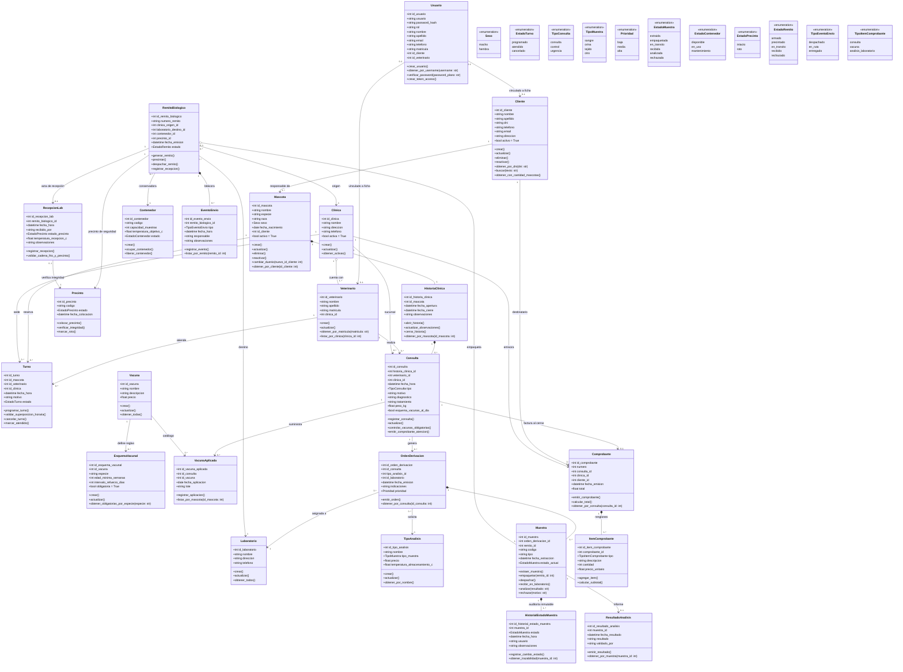

# Red de Clínicas Veterinarias y Derivación a Laboratorio Central: Diagrama de Clases UML

```mermaid
classDiagram
direction TB

class Usuario {
 +int id_usuario
 +string usuario
 +string password_hash
 +string rol
 +string nombre
 +string apellido
 +string email
 +string telefono
 +string matricula
 +int id_cliente
 +int id_veterinario
 +crear_usuario()
 +obtener_por_username(username: str)
 +verificar_password(password_plano: str)
 +crear_token_acceso()
}
class Clinica {
 +int id_clinica
 +string nombre
 +string direccion
 +string telefono
 +bool activa = True
 +crear()
 +actualizar()
 +obtener_activas()
}
class Veterinario {
 +int id_veterinario
 +string nombre
 +string apellido
 +string matricula
 +int clinica_id
 +crear()
 +actualizar()
 +obtener_por_matricula(matricula: str)
 +listar_por_clinica(clinica_id: int)
}
class Laboratorio {
 +int id_laboratorio
 +string nombre
 +string direccion
 +string telefono
 +crear()
 +actualizar()
 +obtener_todos()
}
class Cliente {
 +int id_cliente
 +string nombre
 +string apellido
 +string dni
 +string telefono
 +string email
 +string direccion
 +bool activo = True
 +crear()
 +actualizar()
 +eliminar()
 +reactivar()
 +obtener_por_dni(dni: str)
 +buscar(texto: str)
 +obtener_con_cantidad_mascotas()
}
class Mascota {
 +int id_mascota
 +string nombre
 +string especie
 +string raza
 +Sexo sexo
 +date fecha_nacimiento
 +int id_cliente
 +bool activo = True
 +crear()
 +actualizar()
 +eliminar()
 +reactivar()
 +cambiar_duenio(nuevo_id_cliente: int)
 +obtener_por_cliente(id_cliente: int)
}
class Turno {
 +int id_turno
 +int id_mascota
 +int id_veterinario
 +int id_clinica
 +datetime fecha_hora
 +string motivo
 +EstadoTurno estado
 +programar_turno()
 +validar_superposicion_horaria()
 +cancelar_turno()
 +marcar_atendido()
}
class HistoriaClinica {
 +int id_historia_clinica
 +int id_mascota
 +datetime fecha_apertura
 +datetime fecha_cierre
 +string observaciones
 +abrir_historia()
 +actualizar_observaciones()
 +cerrar_historia()
 +obtener_por_mascota(id_mascota: int)
}
class Consulta {
 +int id_consulta
 +int historia_clinica_id
 +int veterinario_id
 +int clinica_id
 +datetime fecha_hora
 +TipoConsulta tipo
 +string motivo
 +string diagnostico
 +string tratamiento
 +float peso_kg
 +bool esquema_vacunas_al_dia
 +registrar_consulta()
 +actualizar()
 +controlar_vacunas_obligatorias()
 +emitir_comprobante_atencion()
}
class Vacuna {
 +int id_vacuna
 +string nombre
 +string descripcion
 +float precio
 +crear()
 +actualizar()
 +obtener_todas()
}
class EsquemaVacunal {
 +int id_esquema_vacunal
 +int id_vacuna
 +string especie
 +int edad_minima_semanas
 +int intervalo_refuerzo_dias
 +bool obligatoria = True
 +crear()
 +actualizar()
 +obtener_obligatorias_por_especie(especie: str)
}
class VacunaAplicada {
 +int id_vacuna_aplicada
 +int id_consulta
 +int id_vacuna
 +date fecha_aplicacion
 +string lote
 +registrar_aplicacion()
 +listar_por_mascota(id_mascota: int)
}
class TipoAnalisis {
 +int id_tipo_analisis
 +string nombre
 +TipoMuestra tipo_muestra
 +float precio
 +float temperatura_almacenamiento_c
 +crear()
 +actualizar()
 +obtener_por_nombre()
}
class OrdenDerivacion {
 +int id_orden_derivacion
 +int id_consulta
 +int tipo_analisis_id
 +int id_laboratorio
 +datetime fecha_emision
 +string indicaciones
 +Prioridad prioridad
 +emitir_orden()
 +obtener_por_consulta(id_consulta: int)
}
class Muestra {
 +int id_muestra
 +int orden_derivacion_id
 +int remito_id
 +string codigo
 +string tipo
 +datetime fecha_extraccion
 +EstadoMuestra estado_actual
 +extraer_muestra()
 +empaquetar(remito_id: int)
 +despachar()
 +recibir_en_laboratorio()
 +analizar(resultado: str)
 +rechazar(motivo: str)
}
class HistorialEstadoMuestra {
 +int id_historial_estado_muestra
 +int muestra_id
 +EstadoMuestra estado
 +datetime fecha_hora
 +string usuario
 +string observaciones
 +registrar_cambio_estado()
 +obtener_trazabilidad(muestra_id: int)
}
class Contenedor {
 +int id_contenedor
 +string codigo
 +int capacidad_muestras
 +float temperatura_objetivo_c
 +EstadoContenedor estado
 +crear()
 +ocupar_contenedor()
 +liberar_contenedor()
}
class Precinto {
 +int id_precinto
 +string codigo
 +EstadoPrecinto estado
 +datetime fecha_colocacion
 +colocar_precinto()
 +verificar_integridad()
 +marcar_roto()
}
class RemitoBiologico {
 +int id_remito_biologico
 +string numero_remito
 +int clinica_origen_id
 +int laboratorio_destino_id
 +int contenedor_id
 +int precinto_id
 +datetime fecha_emision
 +EstadoRemito estado
 +generar_remito()
 +precintar()
 +despachar_remito()
 +registrar_recepcion()
}
class EventoEnvio {
 +int id_evento_envio
 +int remito_biologico_id
 +TipoEventoEnvio tipo
 +datetime fecha_hora
 +string responsable
 +string observaciones
 +registrar_evento()
 +listar_por_remito(remito_id: int)
}
class RecepcionLab {
 +int id_recepcion_lab
 +int remito_biologico_id
 +datetime fecha_hora
 +string recibido_por
 +EstadoPrecinto estado_precinto
 +float temperatura_recepcion_c
 +string observaciones
 +registrar_recepcion()
 +validar_cadena_frio_y_precinto()
}
class ResultadoAnalisis {
 +int id_resultado_analisis
 +int muestra_id
 +datetime fecha_resultado
 +string resultado
 +string validado_por
 +emitir_resultado()
 +obtener_por_muestra(muestra_id: int)
}
class Comprobante {
 +int id_comprobante
 +int numero
 +int consulta_id
 +int clinica_id
 +int cliente_id
 +datetime fecha_emision
 +float total
 +emitir_comprobante()
 +calcular_total()
 +obtener_por_consulta(consulta_id: int)
}
class ItemComprobante {
 +int id_item_comprobante
 +int comprobante_id
 +TipoItemComprobante tipo
 +string descripcion
 +int cantidad
 +float precio_unitario
 +agregar_item()
 +calcular_subtotal()
}

class Sexo { <<enumeration>>
 macho
 hembra
}
class EstadoTurno { <<enumeration>>
 programado
 atendido
 cancelado
}
class TipoConsulta { <<enumeration>>
 consulta
 control
 urgencia
}
class TipoMuestra { <<enumeration>>
 sangre
 orina
 tejido
 otro
}
class Prioridad { <<enumeration>>
 baja
 media
 alta
}
class EstadoMuestra { <<enumeration>>
 extraida
 empaquetada
 en_transito
 recibida
 analizada
 rechazada
}
class EstadoContenedor { <<enumeration>>
 disponible
 en_uso
 mantenimiento
}
class EstadoPrecinto { <<enumeration>>
 intacto
 roto
}
class EstadoRemito { <<enumeration>>
 armado
 precintado
 en_transito
 recibido
 rechazado
}
class TipoEventoEnvio { <<enumeration>>
 despachado
 en_ruta
 entregado
}
class TipoItemComprobante { <<enumeration>>
 consulta
 vacuna
 analisis_laboratorio
}

Usuario "0..1" --> "0..1" Cliente : vinculado a ficha
Usuario "0..1" --> "0..1" Veterinario : vinculado a ficha
Cliente "1" --> "1..*" Mascota : responsable de
Mascota "1" *-- "1" HistoriaClinica
Clinica "1" o-- "1..*" Veterinario : cuenta con
Veterinario "1" --> "0..*" Turno : atiende
Mascota "1" --> "0..*" Turno : reserva
Clinica "1" --> "0..*" Turno : sede
HistoriaClinica "1" *-- "0..*" Consulta
Veterinario "1" --> "0..*" Consulta : realiza
Clinica "1" --> "0..*" Consulta : sucursal
Vacuna "1" --> "0..*" EsquemaVacunal : define reglas
Consulta "1" --> "0..*" VacunaAplicada : suministra
Vacuna "1" --> "0..*" VacunaAplicada : catálogo
Consulta "1" --> "0..*" OrdenDerivacion : genera
OrdenDerivacion "0..*" --> "1" TipoAnalisis : solicita
OrdenDerivacion "0..*" --> "1" Laboratorio : asignada a
OrdenDerivacion "1" *-- "1..*" Muestra
Muestra "1" *-- "1..*" HistorialEstadoMuestra : auditoría inmutable
RemitoBiologico "0..1" o-- "1..*" Muestra : empaqueta
RemitoBiologico "0..*" --> "1" Contenedor : conservadora
RemitoBiologico "1" --> "1" Precinto : precinto de seguridad
RemitoBiologico "0..*" --> "1" Clinica : origen
RemitoBiologico "0..*" --> "1" Laboratorio : destino
RemitoBiologico "1" *-- "0..*" EventoEnvio : bitácora
RemitoBiologico "1" --> "0..1" RecepcionLab : acta de recepción
RecepcionLab "0..1" --> "1" Precinto : verifica integridad
Muestra "1" --> "0..1" ResultadoAnalisis : informe
Consulta "1" --> "0..1" Comprobante : factura al cerrar
Cliente "1" --> "0..*" Comprobante : destinatario
Clinica "1" --> "0..*" Comprobante : emisora
Comprobante "1" *-- "1..*" ItemComprobante : renglones
```